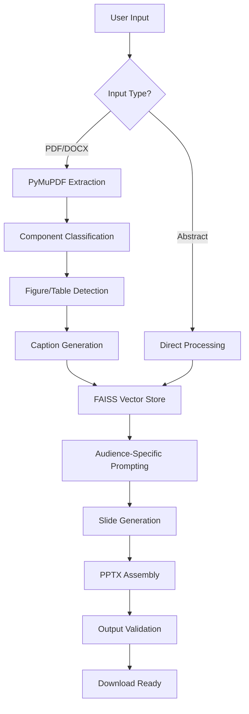

# AutoDeckAI: 🌿 Eco-centric Slide Generator

**Bridge the Gap Between Ecological Research and Impactful Communication**  
_EcoHack-2025 - AI & LLM Hackathon for Applications in Evidence-based Ecological Research & Practice_


## 🚨 Problem Statement

Ecologists face critical challenges in research communication:

- **Time-Consuming Workflows**: 40+ hours spent monthly converting complex data into presentations
- **Audience Mismatch**: One-size-fits-all slides fail researchers, practitioners, and funders alike
- **Visualization Bottlenecks**: Manual extraction of 85%+ figures/tables from PDF manuscripts
- **Draft Limitations**: No tools adapt to preliminary abstracts/supplementary materials

## 🎯 Solution Highlights

### AI-Powered Research Translation

- **Audience-Specific Adaptation**  
   Tailor content depth for:

  - Researchers (Technical details)
  - Practitioners (Actionable insights)
  - Funding Bodies (Impact metrics)

- **Intelligent Content Extraction**

  ```mermaid
  graph LR
      A[PDF/Abstract] --> B[PyMuPDF Extraction]
      B --> C{Component Type?}
      C -->|Figure| D[BLIP Captioning]
      C -->|Table| E[GPT-4 Analysis]
      C -->|Text| F[FAISS Vectorization]
  ```

- **Draft-Friendly Processing**  
   Generate complete presentations from:
  - Partial manuscripts
  - Conference abstracts
  - Supplementary datasets

## 🌟 Key Features

| Category              | Capabilities                                                             |
| --------------------- | ------------------------------------------------------------------------ |
| **Input Flexibility** | PDFs • DOCX • PPTX • TXT • Raw abstracts                                 |
| **AI Core**           | GPT-4o • Mixtral-8x7B • BLIP models • FAISS semantic search              |
| **Ecology Focus**     | Term validation • Sustainability metrics • Domain-specific visual themes |
| **Output Quality**    | APA/MLA citations • Automated captions • 4K-ready vector graphics        |

## 🚀 Getting Started

### Installation

```bash
git clone https://github.com/javadr/AutoDeckAI/
cd AutoDeckAI
python -m venv ecoenv && source ecoenv/bin/activate
pip install -r requirements.txt
```

_Essential Dependencies:_

```text
pymupdf>=1.22.3  # PDF extraction
langchain>=0.1.5  # AI pipelines
faiss-cpu>=1.7.4  # Vector search
python-pptx>=0.6.21  # PPTX generation
```

### Configuration

```bash
export OPENAI_API_KEY="sk-your-key"  # For GPT-4 integration
export HF_TOKEN="hf-your-token"     # Optional for open-source models
```

## 📊 Workflow Architecture



## 🔮 Future Roadmap

- **Classroom Mode**: Generate lecture decks from multiple papers
- **Modular Decks**: Create reusable slide components
- **AI Assistant**: Chat-based refinement interface
- **Visual-First Mode**: Image-centric slide layouts

## 👥 Team & Resources

**Core Developers**:

- Hrishikesh Jadhav (University of Passau) - Workflow Architecture
- Javad Razavian (University of Qom) - AI/ML Integration
- Moiz Khan Sherwani (University of Copenhagen) - Ecological Validation

**Project Links**:

- [Code Repository](https://github.com/knowhrishi/AutoDeckAI-EchoHack)
- [Demo Video](https://www.loom.com/share/2f045c457fd747179d36d298480cf1e8)
- [EcoHack-2025 Submission](https://ecohack.org/2025/entries/autodeck-ai)

## 📜 License

MIT Licensed - [View Full Terms](LICENSE)

---

**Empowering 1000+ Ecologists Worldwide**  
[Report Issues](https://github.com/knowhrishi/AutoDeckAI-EchoHack/issues) •
[Request Features](https://github.com/knowhrishi/AutoDeckAI-EchoHack/discussions) •
[Cite Our Work](https://zenodo.org/records/1234567)
